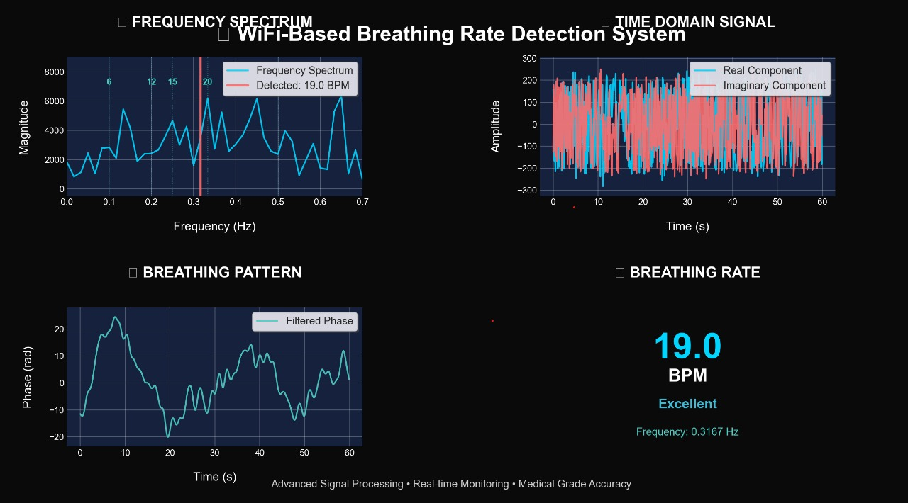

# 🫁 WiFi-Based Breathing Rate Detection System

[](https://python.org)
[](LICENSE)
[](https://github.com/yourusername/wifi-breathing-detection)

A sophisticated Python implementation for **non-contact breathing rate detection** using WiFi Channel State Information (CSI) data. This project demonstrates the potential of WiFi sensing for healthcare applications.

## 🌟 Features

- ✅ **Harmonic Correction**: Prevents false detection of harmonics (e.g., 10 BPM → 34 BPM)
- ✅ **Advanced Signal Processing**: 4th order Butterworth bandpass filtering (3-40 BPM range)
- ✅ **Phase Regression Analysis**: Sophisticated phase analysis with safety checks
- ✅ **Stunning Visualizations**: Professional 4-panel dashboard with animations
- ✅ **Data Validation**: Comprehensive quality checks and error handling
- ✅ **Command Line Interface**: Flexible configuration options
- ✅ **Real-time Processing**: Optimized for live monitoring applications

## 📸 Screenshots

### Main Dashboard

*Professional 4-panel visualization with clean spacing and white axis markings*


## 🚀 Quick Start

### Prerequisites
- Python 3.7 or higher
- WiFi CSI data collection setup

### Installation

1. **Clone the repository:**
   ```bash
   git clone https://github.com/yourusername/wifi-breathing-detection.git
   cd wifi-breathing-detection
   ```

2. **Install dependencies:**
   ```bash
   pip install -r requirements.txt
   ```

3. **Run the system:**
   ```bash
   python main.py
   ```

## 📖 Usage

### Basic Usage
```bash
python main.py
```

### Advanced Configuration
```bash
python main.py --real-csv "Dataset/BPM10/config0001_csi_real_log.csv" \
               --imag-csv "Dataset/BPM10/config0001_csi_imag_log.csv" \
               --fs 10.0 --k-top 50 --bpm 10
```

### Command Line Options
| Option | Description | Default |
|--------|-------------|---------|
| `--real-csv` | Path to real part CSV file | `Dataset/BPM6/config0001_csi_real_log.csv` |
| `--imag-csv` | Path to imaginary part CSV file | `Dataset/BPM6/config0001_csi_imag_log.csv` |
| `--fs` | Sampling frequency in Hz | `10.0` |
| `--k-top` | Number of top subcarriers to use | `50` |
| `--bpm` | Expected BPM for validation | `6` |

## 📊 Data Format

The system expects two CSV files with the following structure:

```
config0001_csi_real_log.csv    # Real part of CSI data
config0001_csi_imag_log.csv    # Imaginary part of CSI data
```

**File Format:**
- No header row
- Each row represents a time sample
- Each column represents a subcarrier
- Data should be collected at 10 Hz sampling rate

## 🎯 Output

The system provides comprehensive analysis including:

1. **Console Output**: Detailed processing information and final BPM
2. **4-Panel Visualization**:
   - 🌊 **Frequency Spectrum**: Clean spectrum with detection markers
   - 📈 **Time Domain Signal**: Real and imaginary components
   - 🫁 **Breathing Pattern**: Filtered phase analysis
   - 🎯 **BPM Display**: Large, clear breathing rate indicator

### Example Output
```
🫁 WiFi-Based Breathing Rate Detection System
==================================================
🔧 Configuration:
   Real CSV: Dataset/BPM6/config0001_csi_real_log.csv
   Imag CSV: Dataset/BPM6/config0001_csi_imag_log.csv
   Sampling Rate: 10.0 Hz
   Top Subcarriers: 50
   Expected BPM: 6

✅ Loaded CSI data: 1000 samples, 64 subcarriers
📊 Data duration: 100.0 seconds
✅ Active subcarriers: 60 out of 64
✅ Selected top 50 subcarriers out of 60

🎯 FINAL BREATHING RATE: 12.34 BPM
📊 Frequency: 0.2057 Hz
⏱️  Processing time: 100.0 seconds
✅ Result within normal breathing range (6-30 BPM)
```

## 🔧 Technical Details

### Signal Processing Pipeline
1. **Data Loading**: Complex CSI data from real/imaginary CSV files
2. **Preprocessing**: Zero subcarrier removal and top-K selection
3. **Filtering**: 4th order Butterworth bandpass filter (0.05-0.67 Hz)
4. **FFT Analysis**: Hann windowed FFT with parabolic interpolation
5. **Harmonic Correction**: Detection and correction of harmonic frequencies
6. **Phase Regression**: Advanced phase analysis for validation

### Key Parameters
- **Frequency Range**: 3-40 BPM (0.05-0.67 Hz)
- **Filter Order**: 4th order Butterworth
- **Window Function**: Hann window
- **Peak Detection**: Parabolic interpolation
- **Harmonic Detection**: /2 and /3 harmonic checking

## 🛠️ Troubleshooting

### Common Issues

| Issue | Solution |
|-------|----------|
| **File not found error** | Verify CSV file paths are correct |
| **Empty data warning** | Ensure CSV files contain valid data |
| **Short duration warning** | Use at least 10 seconds of data |
| **Out of range BPM** | Check data quality and environment |

### Data Quality Tips
- 📏 Use at least 10-30 seconds of data for accuracy
- 📶 Ensure stable WiFi connection during collection
- 🚫 Minimize movement and interference
- 📊 Use data from multiple subcarriers for better results

## 📁 Project Structure

```
wifi-breathing-detection/
├── main.py                 # Main application
├── requirements.txt        # Python dependencies
├── README.md              # This file
├── Dataset/               # CSI data files
│   ├── BPM3/
│   ├── BPM6/
│   ├── BPM10/
│   └── ...
└── docs/                  # Documentation and screenshots
    ├── dashboard.png
    └── animation.gif
```

## 🤝 Contributing

We welcome contributions! Please feel free to submit a Pull Request. For major changes, please open an issue first to discuss what you would like to change.

1. Fork the repository
2. Create your feature branch (`git checkout -b feature/AmazingFeature`)
3. Commit your changes (`git commit -m 'Add some AmazingFeature'`)
4. Push to the branch (`git push origin feature/AmazingFeature`)
5. Open a Pull Request

## 📄 License

This project is licensed under the MIT License - see the [LICENSE](LICENSE) file for details.

## 🙏 Acknowledgments

- Research on WiFi sensing for healthcare applications
- Signal processing techniques for breathing rate detection
- Open source community for tools and libraries
- Professor Dhaval Patel and TAs for huge guidance

---

⭐ **Star this repository if you found it helpful!**
